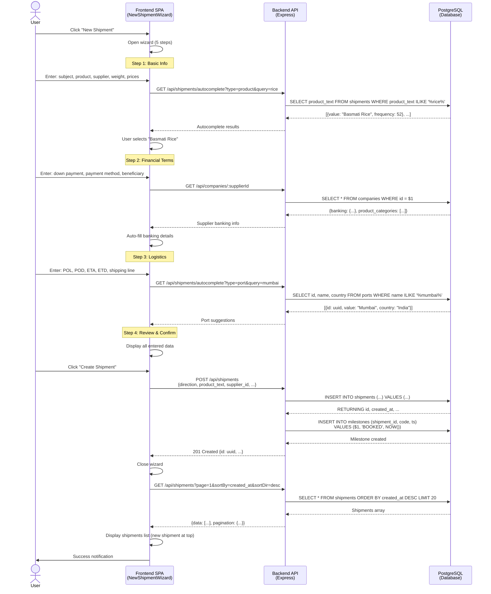
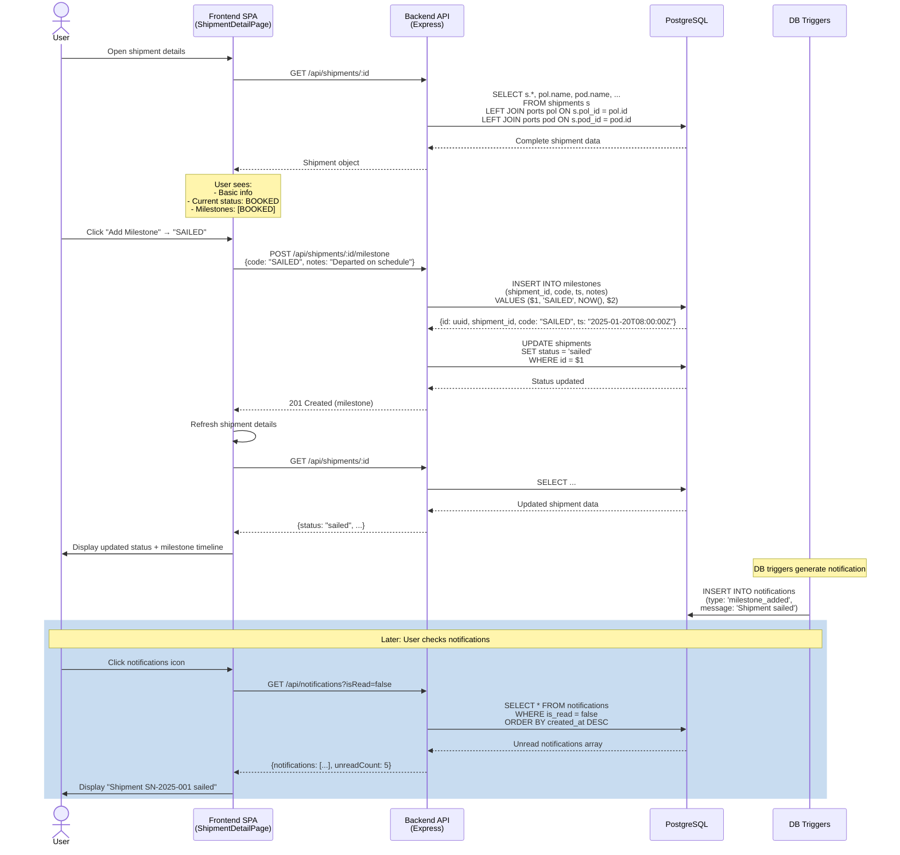
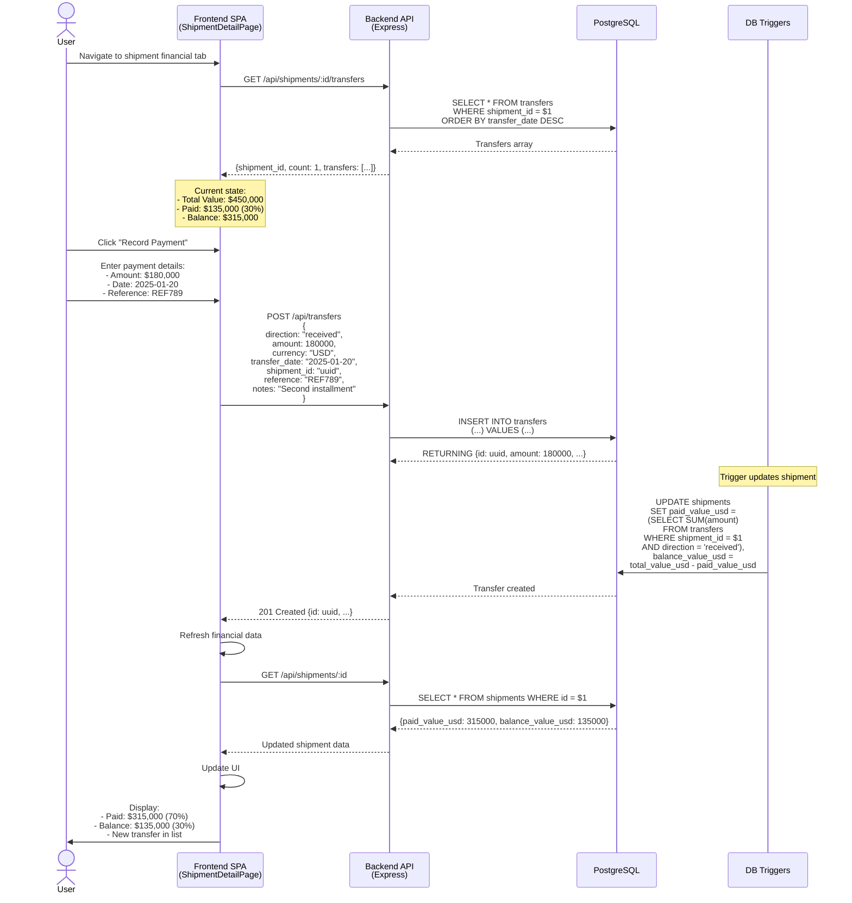
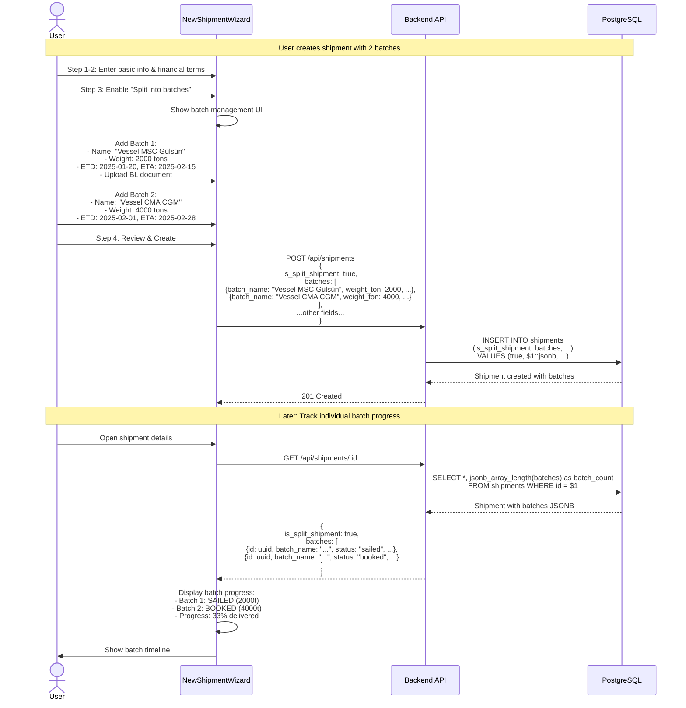

# Loyal Supply Chain - Complete API Surface Map

**Generated**: 2025-01-13  
**API Style**: REST (JSON)  
**Base URL**: `http://localhost:3000/api`  
**Auth**: ❌ None (Mock localStorage only)  
**Total Endpoints**: 28

---

## Table of Contents
1. [Endpoint Summary Table](#endpoint-summary-table)
2. [Detailed Endpoint Documentation](#detailed-endpoint-documentation)
3. [Sequence Diagrams](#sequence-diagrams)
4. [Request/Response Examples](#requestresponse-examples)

---

## Endpoint Summary Table

| # | Method | Path | Handler File | Auth | Purpose |
|---|--------|------|--------------|------|---------|
| **Health & Stats** |||||
| 1 | `GET` | `/api/health` | `routes/health.ts:7` | None | Health check & DB status |
| 2 | `GET` | `/api/health/stats` | `routes/health.ts:29` | None | Dashboard statistics (totals, top origins/destinations) |
| **Shipments** |||||
| 3 | `GET` | `/api/shipments` | `routes/shipments.ts:7` | None | List shipments (pagination, filters, search, sort) |
| 4 | `POST` | `/api/shipments` | `routes/shipments.ts:898` | None | Create new shipment |
| 5 | `PUT` | `/api/shipments/:id` | `routes/shipments.ts:684` | None | Update existing shipment (all fields) |
| 6 | `GET` | `/api/shipments/:id` | `routes/shipments.ts:791` | None | Get single shipment by UUID |
| 7 | `GET` | `/api/shipments/sn/:sn` | `routes/shipments.ts:820` | None | Get shipments by contract number |
| 8 | `GET` | `/api/shipments/:id/transfers` | `routes/shipments.ts:853` | None | Get financial transfers for a shipment |
| 9 | `POST` | `/api/shipments/:id/milestone` | `routes/shipments.ts:875` | None | Add milestone (BOOKED, SAILED, ARRIVED, etc.) |
| 10 | `GET` | `/api/shipments/suggestions` | `routes/shipments.ts:362` | None | Filter suggestions (origins, destinations, products, shipping lines) |
| 11 | `GET` | `/api/shipments/autocomplete` | `routes/shipments.ts:514` | None | Autocomplete search (product, port, supplier, customer, shippingLine) |
| 12 | `GET` | `/api/shipments/compare` | `routes/shipments.ts:600` | None | Compare 2-5 shipments side-by-side |
| 13 | `GET` | `/api/shipments/analytics/price-trends` | `routes/shipments.ts:635` | None | Price trends by product over time |
| **Companies** |||||
| 14 | `GET` | `/api/companies` | `routes/companies.ts:7` | None | List all companies (pagination, search) |
| 15 | `GET` | `/api/companies/:id` | `routes/companies.ts:64` | None | Get single company by UUID |
| 16 | `GET` | `/api/companies/type/suppliers` | `routes/companies.ts:84` | None | List suppliers only (with last purchase) |
| 17 | `GET` | `/api/companies/type/shipping-lines` | `routes/companies.ts:127` | None | List shipping lines only |
| 18 | `PATCH` | `/api/companies/:id/banking` | `routes/companies.ts:159` | None | Update banking info & product categories |
| **Transfers (Finance)** |||||
| 19 | `GET` | `/api/transfers` | `routes/transfers.ts:7` | None | List all financial transfers (pagination, direction filter) |
| 20 | `GET` | `/api/transfers/:id` | `routes/transfers.ts:55` | None | Get single transfer by UUID |
| 21 | `GET` | `/api/transfers/shipment/:shipmentId` | `routes/transfers.ts:78` | None | Get all transfers for a shipment |
| 22 | `POST` | `/api/transfers` | `routes/transfers.ts:100` | None | Create new financial transfer (payment/receipt) |
| **Ports** |||||
| 23 | `GET` | `/api/ports` | `routes/ports.ts:7` | None | List all ports (pagination, search) |
| 24 | `GET` | `/api/ports/:id` | `routes/ports.ts:53` | None | Get single port by UUID |
| 25 | `GET` | `/api/ports/search/query` | `routes/ports.ts:73` | None | Search ports by name/country/UNLOCODE |
| **Notifications** |||||
| 26 | `GET` | `/api/notifications` | `routes/notifications.ts:7` | None | List notifications (read/unread, by type) |
| 27 | `POST` | `/api/notifications/:id/read` | `routes/notifications.ts:60` | None | Mark notification as read |
| 28 | `POST` | `/api/notifications/read-all` | `routes/notifications.ts:83` | None | Mark all notifications as read |
| 29 | `POST` | `/api/notifications/generate` | `routes/notifications.ts:98` | None | Manually trigger notification generation |
| 30 | `DELETE` | `/api/notifications/:id` | `routes/notifications.ts:109` | None | Delete a notification |

---

## Detailed Endpoint Documentation

### 1. Health & Stats

#### `GET /api/health`
**Purpose**: Health check and database connectivity status  
**Handler**: `routes/health.ts:7`  
**Auth**: None

**Response** (200):
```json
{
  "status": "healthy",
  "timestamp": "2025-01-13T10:30:00.000Z",
  "database": "connected",
  "uptime": 3456.789
}
```

**Response** (503 - Unhealthy):
```json
{
  "status": "unhealthy",
  "timestamp": "2025-01-13T10:30:00.000Z",
  "database": "disconnected",
  "error": "Connection timeout"
}
```

---

#### `GET /api/health/stats`
**Purpose**: Dashboard statistics (overview, shipments by status, top origins/destinations)  
**Handler**: `routes/health.ts:29`  
**Auth**: None

**Response** (200):
```json
{
  "overview": {
    "total_shipments": 165,
    "unique_contracts": 142,
    "total_containers": 4200,
    "total_weight_tons": 85000.50,
    "total_value_usd": 12500000.00,
    "total_suppliers": 48,
    "total_shipping_lines": 15,
    "total_ports": 89,
    "total_transfers": 312
  },
  "shipmentsByStatus": [
    { "status": "sailed", "count": 42 },
    { "status": "booked", "count": 35 },
    { "status": "arrived", "count": 28 }
  ],
  "topOrigins": [
    { "port": "Mumbai", "shipment_count": 45 },
    { "port": "Shanghai", "shipment_count": 38 }
  ],
  "topDestinations": [
    { "port": "Umm Qasr", "shipment_count": 62 },
    { "port": "Jebel Ali", "shipment_count": 41 }
  ]
}
```

---

### 2. Shipments

#### `GET /api/shipments`
**Purpose**: List all shipments with comprehensive filtering, search, and pagination  
**Handler**: `routes/shipments.ts:7`  
**Auth**: None

**Query Parameters**:
| Parameter | Type | Description | Example |
|-----------|------|-------------|---------|
| `page` | number | Page number (1-indexed) | `1` |
| `limit` | number | Items per page | `20` |
| `status` | enum | Shipment status | `sailed` |
| `pol` | string | Origin port(s), comma-separated | `Mumbai,Shanghai` |
| `pod` | string | Destination port(s), comma-separated | `Umm Qasr,Jebel Ali` |
| `product` | string | Product filter | `rice` |
| `excludeProduct` | string | Exclude products, comma-separated | `sugar,wheat` |
| `sn` | string | Contract number filter | `SN-2025-001` |
| `search` | string | Universal search (sn, product, ports, booking, bl_no) | `rice from India` |
| `etaMonth` | number | ETA month (1-12) | `2` |
| `etaYear` | number | ETA year | `2025` |
| `etaFrom` | date | ETA range start (YYYY-MM-DD) | `2025-01-01` |
| `etaTo` | date | ETA range end (YYYY-MM-DD) | `2025-12-31` |
| `totalValueOp` | operator | Operator for value comparison | `>` |
| `totalValue` | number | Value threshold | `100000` |
| `containerCountOp` | operator | Operator for container count | `>=` |
| `containerCount` | number | Container threshold | `40` |
| `weightOp` | operator | Operator for weight | `>` |
| `weight` | number | Weight threshold (tons) | `1000` |
| `balanceOp` | operator | Operator for balance | `>` |
| `balance` | number | Balance threshold | `50000` |
| `sortBy` | column | Sort column | `created_at` |
| `sortDir` | asc/desc | Sort direction | `desc` |
| `includeDelivered` | boolean | Include delivered shipments | `false` |

**Operators**: `<`, `>`, `<=`, `>=`, `=`

**Sort Columns**: `sn`, `product_text`, `eta`, `etd`, `weight_ton`, `total_value_usd`, `fixed_price_usd_per_ton`, `container_count`, `balance_value_usd`, `status`, `created_at`, `updated_at`

**Response** (200):
```json
{
  "data": [
    {
      "id": "uuid-here",
      "sn": "SN-2025-001",
      "direction": "incoming",
      "subject": "Rice shipment from India",
      "product_text": "Basmati Rice",
      "container_count": 40,
      "weight_ton": 1000,
      "fixed_price_usd_per_ton": 450,
      "selling_price_usd_per_ton": 520,
      "pol_id": "uuid",
      "pol_name": "Mumbai",
      "pol_country": "India",
      "pod_id": "uuid",
      "pod_name": "Umm Qasr",
      "pod_country": "Iraq",
      "eta": "2025-02-15",
      "etd": "2025-01-20",
      "status": "sailed",
      "shipping_line_name": "MSC",
      "total_value_usd": 450000,
      "paid_value_usd": 135000,
      "balance_value_usd": 315000,
      "is_split_shipment": false,
      "created_at": "2025-01-10T08:00:00.000Z",
      "updated_at": "2025-01-15T14:30:00.000Z"
    }
  ],
  "pagination": {
    "page": 1,
    "limit": 20,
    "total": 165,
    "pages": 9
  }
}
```

---

#### `POST /api/shipments`
**Purpose**: Create a new shipment  
**Handler**: `routes/shipments.ts:898`  
**Auth**: None

**Request Body**:
```json
{
  "direction": "incoming",
  "subject": "Rice shipment from India",
  "product_text": "Basmati Rice",
  "sn": "SN-2025-001",
  "supplier_id": "uuid",
  "customer_id": null,
  "container_count": 40,
  "weight_ton": 1000,
  "weight_unit": "tons",
  "fixed_price_usd_per_ton": 450,
  "selling_price_usd_per_ton": 520,
  "pol_id": "uuid",
  "pod_id": "uuid",
  "shipping_line_id": "uuid",
  "eta": "2025-02-15",
  "etd": "2025-01-20",
  "status": "booked",
  "booking_no": "BKG123456",
  "cargo_type": "containers",
  "has_broker": false,
  "is_split_shipment": false,
  "batches": [],
  "down_payment_type": "percentage",
  "down_payment_percentage": 30,
  "payment_method": "swift",
  "payment_schedule": [
    {
      "description": "Down payment",
      "amount_usd": 135000,
      "due_date": "2025-01-10"
    }
  ],
  "notes": "First shipment of Q1 2025"
}
```

**Response** (201):
```json
{
  "id": "uuid-new",
  "sn": "SN-2025-001",
  "direction": "incoming",
  "product_text": "Basmati Rice",
  "created_at": "2025-01-13T10:30:00.000Z",
  "...": "... all other fields ..."
}
```

---

#### `PUT /api/shipments/:id`
**Purpose**: Update an existing shipment (full update, all fields)  
**Handler**: `routes/shipments.ts:684`  
**Auth**: None

**URL Params**: `id` (UUID)

**Request Body**: Same as POST, all fields optional except `id` in URL

**Response** (200):
```json
{
  "id": "uuid",
  "updated_at": "2025-01-13T11:00:00.000Z",
  "...": "... all fields ..."
}
```

**Response** (404):
```json
{
  "error": "Shipment not found"
}
```

---

#### `GET /api/shipments/:id`
**Purpose**: Get a single shipment by UUID with all relationships  
**Handler**: `routes/shipments.ts:791`  
**Auth**: None

**URL Params**: `id` (UUID)

**Response** (200):
```json
{
  "id": "uuid",
  "sn": "SN-2025-001",
  "direction": "incoming",
  "subject": "Rice shipment from India",
  "product_text": "Basmati Rice",
  "supplier_id": "uuid",
  "customer_id": null,
  "pol_id": "uuid",
  "pol_name": "Mumbai",
  "pol_country": "India",
  "pod_id": "uuid",
  "pod_name": "Umm Qasr",
  "pod_country": "Iraq",
  "shipping_line_id": "uuid",
  "shipping_line_name": "MSC",
  "container_count": 40,
  "weight_ton": 1000,
  "weight_unit": "tons",
  "fixed_price_usd_per_ton": 450,
  "selling_price_usd_per_ton": 520,
  "eta": "2025-02-15",
  "etd": "2025-01-20",
  "free_time_days": 7,
  "status": "sailed",
  "booking_no": "BKG123456",
  "bl_no": "BL789012",
  "cargo_type": "containers",
  "vessel_name": "MSC Gülsün",
  "vessel_imo": "IMO1234567",
  "has_broker": false,
  "is_split_shipment": false,
  "batches": [],
  "down_payment_type": "percentage",
  "down_payment_percentage": 30,
  "payment_method": "swift",
  "payment_schedule": [...],
  "additional_costs": [...],
  "payment_beneficiaries": [...],
  "documents": [],
  "total_value_usd": 450000,
  "paid_value_usd": 135000,
  "balance_value_usd": 315000,
  "notes": "First shipment of Q1 2025",
  "created_at": "2025-01-10T08:00:00.000Z",
  "updated_at": "2025-01-15T14:30:00.000Z"
}
```

**Response** (404):
```json
{
  "error": "Shipment not found"
}
```

---

#### `GET /api/shipments/sn/:sn`
**Purpose**: Get all shipments by contract number (supports multiple shipments per SN)  
**Handler**: `routes/shipments.ts:820`  
**Auth**: None

**URL Params**: `sn` (string)

**Response** (200):
```json
{
  "sn": "SN-2025-001",
  "count": 2,
  "shipments": [
    { "...": "shipment 1 data" },
    { "...": "shipment 2 data" }
  ]
}
```

---

#### `GET /api/shipments/:id/transfers`
**Purpose**: Get all financial transfers (payments) for a shipment  
**Handler**: `routes/shipments.ts:853`  
**Auth**: None

**URL Params**: `id` (UUID)

**Response** (200):
```json
{
  "shipment_id": "uuid",
  "count": 3,
  "transfers": [
    {
      "id": "uuid",
      "direction": "received",
      "amount": 135000,
      "currency": "USD",
      "transfer_date": "2025-01-10",
      "bank_name": "National Bank",
      "reference": "REF123456",
      "created_at": "2025-01-10T09:00:00.000Z"
    }
  ]
}
```

---

#### `POST /api/shipments/:id/milestone`
**Purpose**: Add a milestone event to a shipment (BOOKED, SAILED, ARRIVED, etc.)  
**Handler**: `routes/shipments.ts:875`  
**Auth**: None

**URL Params**: `id` (UUID)

**Request Body**:
```json
{
  "code": "SAILED",
  "notes": "Departed from Mumbai on schedule"
}
```

**Milestone Codes**: `BOOKED`, `GATE_IN`, `LOADED`, `SAILED`, `ARRIVED`, `DELIVERED`

**Response** (201):
```json
{
  "id": "uuid",
  "shipment_id": "uuid",
  "code": "SAILED",
  "ts": "2025-01-20T08:00:00.000Z",
  "notes": "Departed from Mumbai on schedule"
}
```

---

#### `GET /api/shipments/suggestions`
**Purpose**: Get filter suggestions (origins, destinations, products, shipping lines) based on current filters  
**Handler**: `routes/shipments.ts:362`  
**Auth**: None

**Query Parameters**:
- `origin` - Exclude this origin from suggestions
- `destination` - Exclude this destination
- `product` - Exclude this product
- `shippingLine` - Exclude this shipping line
- `valueRange` - Value range filter
- `dateRange` - Date range filter

**Response** (200):
```json
{
  "origins": [
    { "name": "Mumbai", "count": 45, "country": "India" },
    { "name": "Shanghai", "count": 38, "country": "China" }
  ],
  "destinations": [
    { "name": "Umm Qasr", "count": 62, "country": "Iraq" },
    { "name": "Jebel Ali", "count": 41, "country": "UAE" }
  ],
  "products": [
    { "name": "Basmati Rice", "count": 52 },
    { "name": "Wheat", "count": 38 }
  ],
  "shippingLines": [
    { "name": "MSC", "count": 68 },
    { "name": "Maersk", "count": 47 }
  ],
  "valueRanges": [
    { "label": "< $100,000", "value": "<100000", "count": 25 },
    { "label": "$100,000 - $500,000", "value": "100000-500000", "count": 89 }
  ],
  "dateRanges": [
    { "label": "Next 7 days", "value": "next-7-days", "count": 12 },
    { "label": "Next 30 days", "value": "next-30-days", "count": 45 }
  ]
}
```

---

#### `GET /api/shipments/autocomplete`
**Purpose**: Autocomplete search for products, ports, suppliers, customers, shipping lines  
**Handler**: `routes/shipments.ts:514`  
**Auth**: None

**Query Parameters**:
- `type` (required): `product`, `port`, `supplier`, `customer`, `shippingLine`
- `query` (required): Search term

**Response** (200):
```json
{
  "type": "product",
  "query": "rice",
  "results": [
    { "value": "Basmati Rice", "frequency": 52 },
    { "value": "Jasmine Rice", "frequency": 28 },
    { "value": "Long Grain Rice", "frequency": 15 }
  ]
}
```

For `port`, `supplier`, `customer`, `shippingLine` types:
```json
{
  "type": "port",
  "query": "mum",
  "results": [
    { "id": "uuid", "value": "Mumbai", "country": "India", "frequency": 45 },
    { "id": "uuid", "value": "Mundra", "country": "India", "frequency": 12 }
  ]
}
```

---

#### `GET /api/shipments/compare`
**Purpose**: Compare 2-5 shipments side-by-side  
**Handler**: `routes/shipments.ts:600`  
**Auth**: None

**Query Parameters**:
- `ids` (required): Comma-separated UUIDs (2-5 shipments)

**Response** (200):
```json
{
  "shipments": [
    { "...": "shipment 1 full data" },
    { "...": "shipment 2 full data" },
    { "...": "shipment 3 full data" }
  ]
}
```

**Response** (400):
```json
{
  "error": "Please provide 2-5 shipment IDs"
}
```

---

#### `GET /api/shipments/analytics/price-trends`
**Purpose**: Price trends by product over time (monthly aggregation)  
**Handler**: `routes/shipments.ts:635`  
**Auth**: None

**Query Parameters**:
- `product` (optional): Product filter
- `startDate` (optional): YYYY-MM-DD
- `endDate` (optional): YYYY-MM-DD

**Response** (200):
```json
{
  "trends": [
    {
      "month": "2025-01-01T00:00:00.000Z",
      "product_text": "Basmati Rice",
      "avg_price_usd_per_ton": 450.25,
      "min_price_usd_per_ton": 420.00,
      "max_price_usd_per_ton": 480.00,
      "shipment_count": 12,
      "total_weight_ton": 12000
    }
  ]
}
```

---

### 3. Companies

#### `GET /api/companies`
**Purpose**: List all companies with pagination and search  
**Handler**: `routes/companies.ts:7`  
**Auth**: None

**Query Parameters**:
- `page` (default: 1)
- `limit` (default: 50)
- `search` - Search by name or country

**Response** (200):
```json
{
  "data": [
    {
      "id": "uuid",
      "name": "ABC Trading LLC",
      "country": "UAE",
      "city": "Dubai",
      "phone": "+971-xxx",
      "email": "info@abc.ae",
      "is_supplier": true,
      "is_customer": false,
      "is_shipping_line": false,
      "extra_json": {
        "banking": { "..." },
        "product_categories": ["Rice", "Wheat"]
      },
      "last_product": "Basmati Rice",
      "last_purchase_date": "2025-01-05T00:00:00.000Z",
      "created_at": "2024-01-01T00:00:00.000Z"
    }
  ],
  "pagination": {
    "page": 1,
    "limit": 50,
    "total": 125
  }
}
```

---

#### `GET /api/companies/:id`
**Purpose**: Get a single company by UUID  
**Handler**: `routes/companies.ts:64`  
**Auth**: None

**URL Params**: `id` (UUID)

**Response** (200): Single company object (same structure as list)

**Response** (404):
```json
{
  "error": "Company not found"
}
```

---

#### `GET /api/companies/type/suppliers`
**Purpose**: List suppliers only, with last purchase information  
**Handler**: `routes/companies.ts:84`  
**Auth**: None

**Query Parameters**:
- `page` (default: 1)
- `limit` (default: 50)

**Response** (200): Same structure as `/api/companies`, filtered to `is_supplier = true`

---

#### `GET /api/companies/type/shipping-lines`
**Purpose**: List shipping lines only  
**Handler**: `routes/companies.ts:127`  
**Auth**: None

**Query Parameters**:
- `page` (default: 1)
- `limit` (default: 50)

**Response** (200): Same structure, filtered to `is_shipping_line = true`

---

#### `PATCH /api/companies/:id/banking`
**Purpose**: Update company banking information and product categories  
**Handler**: `routes/companies.ts:159`  
**Auth**: None (TODO: Replace 'system' with actual user ID)

**URL Params**: `id` (UUID)

**Request Body**:
```json
{
  "banking": {
    "bank_name": "National Bank of Dubai",
    "account_name": "ABC Trading LLC",
    "account_number": "1234567890",
    "iban": "AE070331234567890123456",
    "swift_code": "NBDUAEAA",
    "bank_address": "Dubai, UAE",
    "intermediary_bank": "Citibank N.A.",
    "intermediary_swift": "CITIUS33"
  },
  "product_categories": ["Rice", "Wheat", "Sugar"]
}
```

**Response** (200):
```json
{
  "id": "uuid",
  "extra_json": {
    "banking": {
      "bank_name": "National Bank of Dubai",
      "account_name": "ABC Trading LLC",
      "account_number": "1234567890",
      "iban": "AE070331234567890123456",
      "swift_code": "NBDUAEAA",
      "bank_address": "Dubai, UAE",
      "intermediary_bank": "Citibank N.A.",
      "intermediary_swift": "CITIUS33",
      "last_updated": "2025-01-13T10:30:00.000Z",
      "updated_by": "system"
    },
    "product_categories": ["Rice", "Wheat", "Sugar"]
  },
  "updated_at": "2025-01-13T10:30:00.000Z"
}
```

---

### 4. Transfers (Finance)

#### `GET /api/transfers`
**Purpose**: List all financial transfers with pagination  
**Handler**: `routes/transfers.ts:7`  
**Auth**: None

**Query Parameters**:
- `page` (default: 1)
- `limit` (default: 50)
- `direction` (optional): `received` or `paid`

**Response** (200):
```json
{
  "data": [
    {
      "id": "uuid",
      "shipment_id": "uuid",
      "shipment_sn": "SN-2025-001",
      "direction": "received",
      "amount": 135000,
      "currency": "USD",
      "transfer_date": "2025-01-10",
      "bank_name": "National Bank",
      "bank_account": "1234567890",
      "sender": "ABC Trading LLC",
      "receiver": "Loyal International",
      "reference": "REF123456",
      "pi_no": "PI-2025-001",
      "notes": "Down payment",
      "created_at": "2025-01-10T09:00:00.000Z"
    }
  ],
  "pagination": {
    "page": 1,
    "limit": 50,
    "total": 312
  }
}
```

---

#### `GET /api/transfers/:id`
**Purpose**: Get a single transfer by UUID  
**Handler**: `routes/transfers.ts:55`  
**Auth**: None

**URL Params**: `id` (UUID)

**Response** (200): Single transfer object

**Response** (404):
```json
{
  "error": "Transfer not found"
}
```

---

#### `GET /api/transfers/shipment/:shipmentId`
**Purpose**: Get all transfers for a specific shipment  
**Handler**: `routes/transfers.ts:78`  
**Auth**: None

**URL Params**: `shipmentId` (UUID)

**Response** (200):
```json
{
  "shipment_id": "uuid",
  "count": 3,
  "transfers": [
    { "...": "transfer 1" },
    { "...": "transfer 2" },
    { "...": "transfer 3" }
  ]
}
```

---

#### `POST /api/transfers`
**Purpose**: Create a new financial transfer (payment received or made)  
**Handler**: `routes/transfers.ts:100`  
**Auth**: None

**Request Body**:
```json
{
  "direction": "received",
  "amount": 135000,
  "currency": "USD",
  "transfer_date": "2025-01-10",
  "bank_name": "National Bank",
  "bank_account": "1234567890",
  "sender": "ABC Trading LLC",
  "receiver": "Loyal International",
  "reference": "REF123456",
  "pi_no": "PI-2025-001",
  "notes": "Down payment for rice shipment",
  "shipment_id": "uuid"
}
```

**Required Fields**: `direction`, `amount`, `currency`

**Response** (201):
```json
{
  "id": "uuid-new",
  "direction": "received",
  "amount": 135000,
  "created_at": "2025-01-13T10:30:00.000Z",
  "...": "... all fields ..."
}
```

**Response** (400):
```json
{
  "error": "Missing required fields: direction, amount, currency"
}
```

---

### 5. Ports

#### `GET /api/ports`
**Purpose**: List all ports with pagination and search  
**Handler**: `routes/ports.ts:7`  
**Auth**: None

**Query Parameters**:
- `page` (default: 1)
- `limit` (default: 100)
- `search` - Search by name, country, or UNLOCODE

**Response** (200):
```json
{
  "data": [
    {
      "id": "uuid",
      "name": "Mumbai",
      "country": "India",
      "unlocode": "INMUN",
      "code": "MUM",
      "created_at": "2024-01-01T00:00:00.000Z"
    }
  ],
  "pagination": {
    "page": 1,
    "limit": 100,
    "total": 234
  }
}
```

---

#### `GET /api/ports/:id`
**Purpose**: Get a single port by UUID  
**Handler**: `routes/ports.ts:53`  
**Auth**: None

**URL Params**: `id` (UUID)

**Response** (200): Single port object

**Response** (404):
```json
{
  "error": "Port not found"
}
```

---

#### `GET /api/ports/search/query`
**Purpose**: Search ports by name, country, or UNLOCODE (returns top 20)  
**Handler**: `routes/ports.ts:73`  
**Auth**: None

**Query Parameters**:
- `q` (required): Search query

**Response** (200):
```json
{
  "query": "mum",
  "count": 2,
  "results": [
    {
      "id": "uuid",
      "name": "Mumbai",
      "country": "India",
      "unlocode": "INMUN"
    },
    {
      "id": "uuid",
      "name": "Mundra",
      "country": "India",
      "unlocode": "INMUN"
    }
  ]
}
```

**Response** (400):
```json
{
  "error": "Search query (q) is required"
}
```

---

### 6. Notifications

#### `GET /api/notifications`
**Purpose**: List notifications with filters for read/unread status and type  
**Handler**: `routes/notifications.ts:7`  
**Auth**: None

**Query Parameters**:
- `isRead` (optional): `true` or `false`
- `type` (optional): Notification type
- `limit` (default: 50)
- `offset` (default: 0)

**Response** (200):
```json
{
  "notifications": [
    {
      "id": "uuid",
      "shipment_id": "uuid",
      "type": "eta_approaching",
      "message": "Shipment SN-2025-001 (Basmati Rice) arriving in 3 days",
      "is_read": false,
      "read_at": null,
      "created_at": "2025-01-13T08:00:00.000Z",
      "sn": "SN-2025-001",
      "product_text": "Basmati Rice",
      "eta": "2025-01-16",
      "pol_name": "Mumbai",
      "pod_name": "Umm Qasr"
    }
  ],
  "unreadCount": 12
}
```

---

#### `POST /api/notifications/:id/read`
**Purpose**: Mark a notification as read  
**Handler**: `routes/notifications.ts:60`  
**Auth**: None

**URL Params**: `id` (UUID)

**Response** (200):
```json
{
  "id": "uuid",
  "is_read": true,
  "read_at": "2025-01-13T10:30:00.000Z",
  "...": "... all fields ..."
}
```

**Response** (404):
```json
{
  "error": "Notification not found"
}
```

---

#### `POST /api/notifications/read-all`
**Purpose**: Mark all notifications as read  
**Handler**: `routes/notifications.ts:83`  
**Auth**: None

**Response** (200):
```json
{
  "message": "All notifications marked as read"
}
```

---

#### `POST /api/notifications/generate`
**Purpose**: Manually trigger notification generation (calls DB function)  
**Handler**: `routes/notifications.ts:98`  
**Auth**: None

**Response** (200):
```json
{
  "message": "Notifications generated successfully"
}
```

---

#### `DELETE /api/notifications/:id`
**Purpose**: Delete a notification  
**Handler**: `routes/notifications.ts:109`  
**Auth**: None

**URL Params**: `id` (UUID)

**Response** (200):
```json
{
  "message": "Notification deleted"
}
```

**Response** (404):
```json
{
  "error": "Notification not found"
}
```

---

## Sequence Diagrams

### 1. New Shipment Creation Flow (Frontend → Backend)



---

### 2. Shipment Milestone Tracking Flow



---

### 3. Financial Transfer Recording Flow



---

### 4. Split Shipment with Batches (Advanced Flow)



---

## Request/Response Examples

### Complex Search Query Example

**Request**:
```bash
GET /api/shipments?search=rice from India to Iraq&etaMonth=2&etaYear=2025&totalValueOp=>&totalValue=100000&sortBy=created_at&sortDir=desc&page=1&limit=10
```

**Parsed by Smart Search Parser**:
- Product: "rice"
- Origin (POL): "India"
- Destination (POD): "Iraq"
- ETA: February 2025
- Total Value: > $100,000
- Sort: Newest first

**Response**:
```json
{
  "data": [
    {
      "id": "uuid-1",
      "sn": "SN-2025-045",
      "product_text": "Basmati Rice",
      "pol_name": "Mumbai",
      "pol_country": "India",
      "pod_name": "Umm Qasr",
      "pod_country": "Iraq",
      "eta": "2025-02-15",
      "total_value_usd": 450000,
      "status": "sailed",
      "created_at": "2025-01-10T08:00:00.000Z"
    },
    {
      "id": "uuid-2",
      "sn": "SN-2025-032",
      "product_text": "Jasmine Rice",
      "pol_name": "Chennai",
      "pol_country": "India",
      "pod_name": "Basra",
      "pod_country": "Iraq",
      "eta": "2025-02-20",
      "total_value_usd": 380000,
      "status": "booked",
      "created_at": "2025-01-08T14:30:00.000Z"
    }
  ],
  "pagination": {
    "page": 1,
    "limit": 10,
    "total": 8,
    "pages": 1
  }
}
```

---

### Error Response Examples

**404 - Not Found**:
```json
{
  "error": "Shipment not found"
}
```

**400 - Bad Request**:
```json
{
  "error": "Missing required fields: direction, amount, currency"
}
```

**500 - Internal Server Error**:
```json
{
  "error": "Database connection failed",
  "details": "Connection timeout after 2000ms",
  "stack": "Error: Connection timeout\n    at ..." // (development only)
}
```

---

## API Design Notes

### Authentication
- **Current**: ❌ No authentication
- **Frontend**: Mock localStorage token (`auth_token = "mock-token"`)
- **Backend**: No middleware checks
- **Risk**: Critical security gap for production

### Rate Limiting
- **Status**: ❌ Not implemented
- **Risk**: API vulnerable to abuse
- **Recommendation**: Add `express-rate-limit` middleware

### Validation
- **Status**: ⚠️ Minimal (manual checks)
- **Missing**: Schema validation (Zod, Yup, Joi)
- **Current**: Only checks for required fields in critical endpoints

### Error Handling
- **Middleware**: Centralized error handler (`middleware/errorHandler.ts`)
- **Format**: Consistent JSON responses
- **Stack Traces**: Only in development (`process.env.NODE_ENV === 'development'`)

### CORS
- **Status**: ✅ Enabled
- **Config**: All origins allowed (`cors()`)
- **Risk**: Should be restricted in production

### Pagination
- **Default Page Size**: 20 (shipments), 50 (companies, transfers, ports, notifications)
- **Format**: `{page, limit, total, pages?}`
- **Query Params**: `?page=1&limit=20`

### Filtering
- **Multi-value**: Comma-separated (e.g., `pol=India,China`)
- **Operators**: `<`, `>`, `<=`, `>=`, `=` (for numeric fields)
- **Date Ranges**: `etaFrom` & `etaTo` (YYYY-MM-DD)
- **Search**: Universal `search` param (ILIKE across multiple fields)

---

**End of API Surface Map**

