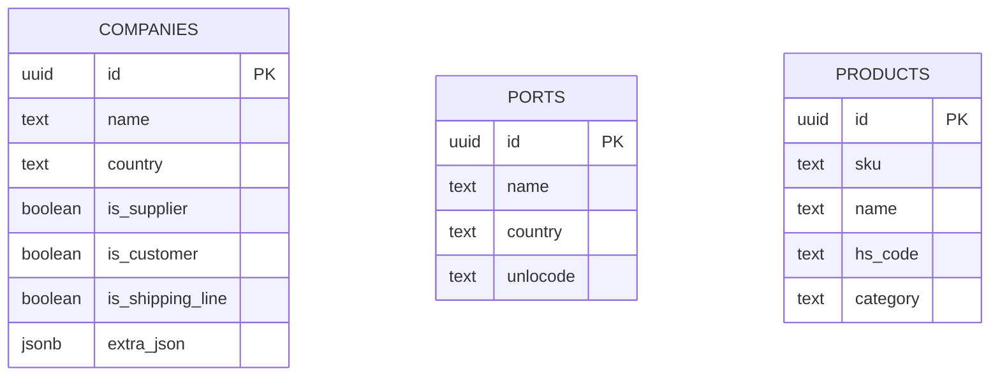
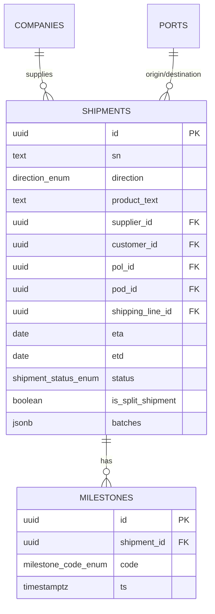
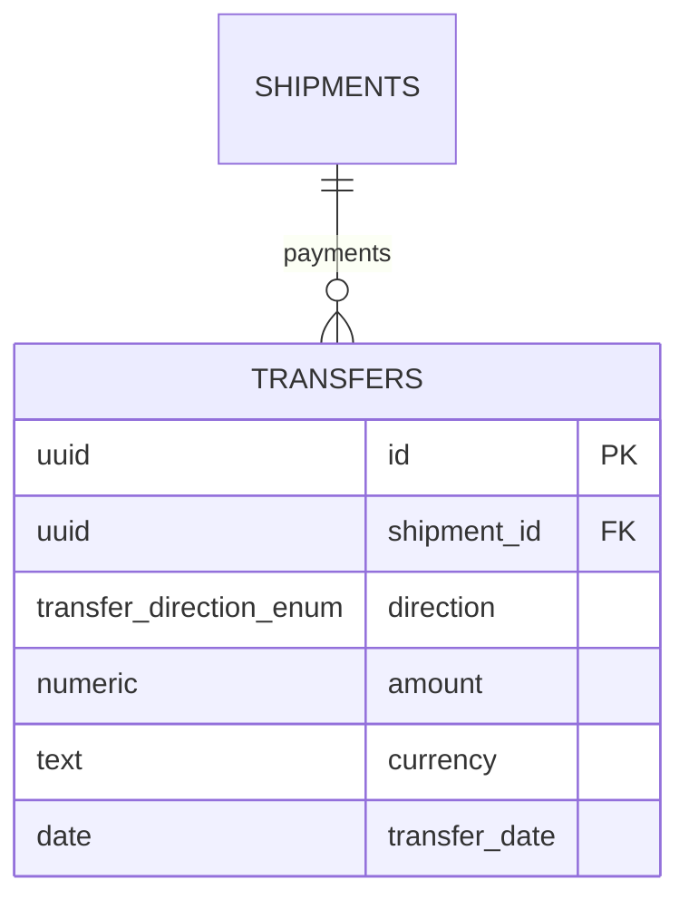
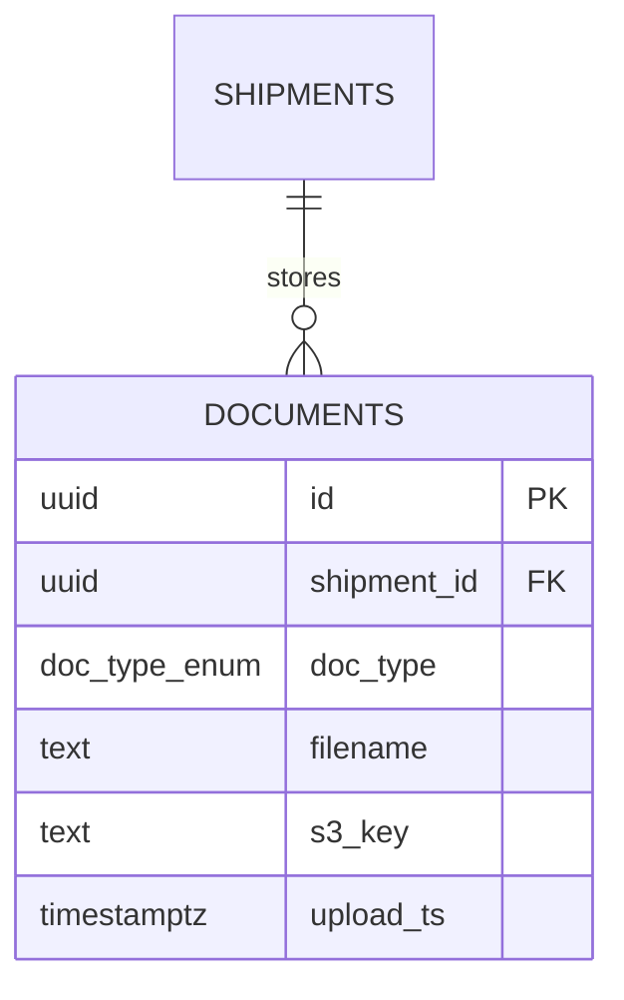
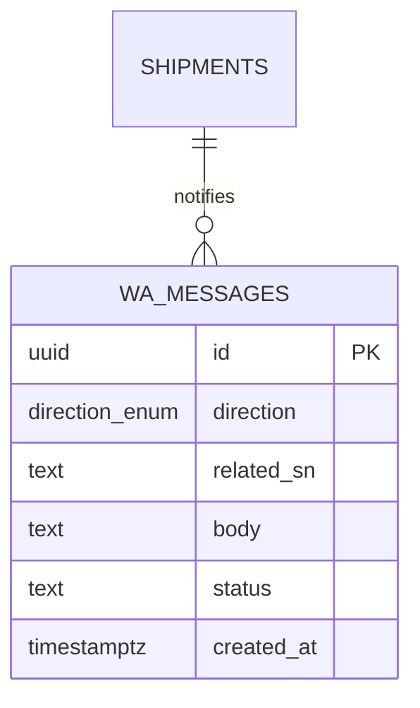
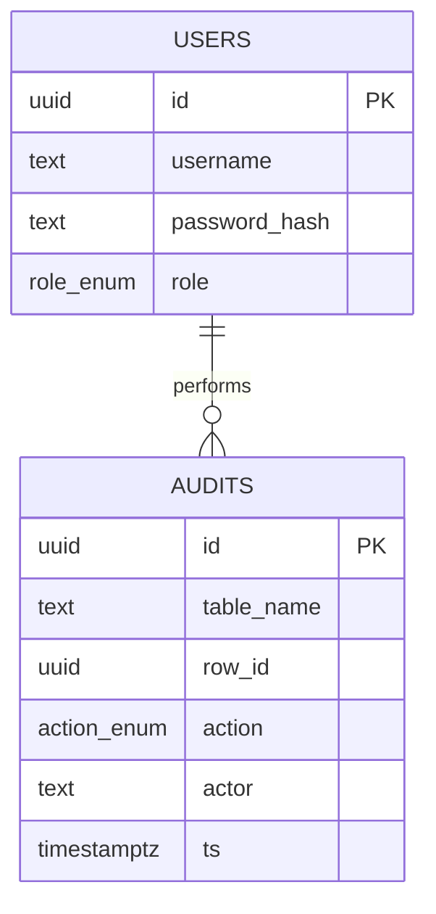

# Loyal Supply Chain - Detailed Entity Relationship Diagram (ERD)

**Generated**: 2025-01-13  
**Database**: PostgreSQL 16+  
**Schemas**: 6 (master_data, logistics, finance, archive, comm, security)

---

## Table of Contents
1. [Complete ERD Diagram](#complete-erd-diagram)
2. [Schema-Specific ERDs](#schema-specific-erds)
3. [Table Descriptions](#table-descriptions)
4. [Relationships](#relationships)
5. [Indexes & Constraints](#indexes--constraints)
6. [JSONB Field Structures](#jsonb-field-structures)

---

## Complete ERD Diagram

```mermaid
erDiagram
    %% Master Data Schema
    COMPANIES ||--o{ SHIPMENTS_SUPPLIER : "supplies"
    COMPANIES ||--o{ SHIPMENTS_CUSTOMER : "buys"
    COMPANIES ||--o{ SHIPMENTS_SHIPPING : "transports"
    PORTS ||--o{ SHIPMENTS_POL : "origin"
    PORTS ||--o{ SHIPMENTS_POD : "destination"
    PRODUCTS ||--o{ SHIPMENTS : "defines"
    
    %% Logistics Schema
    SHIPMENTS ||--o{ MILESTONES : "tracks"
    SHIPMENTS ||--o{ TRANSFERS : "finances"
    SHIPMENTS ||--o{ DOCUMENTS : "stores"
    SHIPMENTS ||--o{ WA_MESSAGES : "communicates"
    
    %% Security Schema
    USERS ||--o{ AUDITS : "performs"
    
    COMPANIES {
        uuid id PK "Primary Key"
        text name "Company name"
        text country "Country of operation"
        text city "City"
        text address "Physical address"
        text website "Company website"
        text phone "Contact phone"
        text email "Contact email"
        boolean is_supplier "Acts as supplier"
        boolean is_customer "Acts as customer"
        boolean is_shipping_line "Shipping line flag"
        boolean is_forwarder "Freight forwarder flag"
        boolean is_bank "Banking institution flag"
        jsonb extra_json "Extended data: banking_info, product_categories, last_purchase"
        timestamptz created_at "Record creation timestamp"
        timestamptz updated_at "Last update timestamp"
        text created_by "User who created"
        text updated_by "User who last updated"
        boolean is_deleted "Soft delete flag"
    }
    
    PORTS {
        uuid id PK "Primary Key"
        text name "Port name"
        text country "Country"
        text unlocode "UN/LOCODE standard code"
        text code "Internal code"
        timestamptz created_at "Record creation timestamp"
        timestamptz updated_at "Last update timestamp"
    }
    
    PRODUCTS {
        uuid id PK "Primary Key"
        text sku "Stock Keeping Unit"
        text name "Product name"
        text hs_code "Harmonized System code"
        text category "Product category"
        text uom "Unit of measure"
        text pack_type "Packaging type"
        numeric net_weight_kg "Net weight in kg"
        jsonb spec_json "Product specifications"
        timestamptz created_at "Record creation timestamp"
        timestamptz updated_at "Last update timestamp"
    }
    
    SHIPMENTS {
        uuid id PK "Primary Key"
        text sn "Contract number / Serial Number"
        direction_enum direction "incoming (buyer) | outgoing (seller)"
        text subject "Shipment subject/title"
        text product_text "Product description (free text)"
        integer container_count "Number of containers/units"
        numeric weight_ton "Weight in tons"
        varchar weight_unit "tons | kg | barrels | other"
        varchar weight_unit_custom "Custom unit if other"
        integer barrels "Number of barrels (for oil/liquids)"
        numeric fixed_price_usd_per_ton "Purchase price per ton"
        numeric fixed_price_usd_per_barrel "Purchase price per barrel"
        numeric selling_price_usd_per_ton "Selling price per ton"
        numeric selling_price_usd_per_barrel "Selling price per barrel"
        uuid supplier_id FK "Supplier company (incoming)"
        uuid customer_id FK "Customer company (outgoing)"
        uuid pol_id FK "Port of Loading"
        uuid pod_id FK "Port of Discharge"
        uuid shipping_line_id FK "Shipping line company"
        date eta "Estimated Time of Arrival"
        date etd "Estimated Time of Departure"
        integer free_time_days "Free storage days at port"
        shipment_status_enum status "planning | booked | gate_in | loaded | sailed | arrived | delivered | invoiced"
        text paperwork_status "Document status description"
        text booking_no "Booking reference number"
        text bl_no "Bill of Lading number"
        date deposit_date "Deposit payment date"
        date contract_ship_date "Contractual shipping date"
        date bl_date "Bill of Lading issue date"
        numeric total_value_usd "Total contract value (computed)"
        numeric paid_value_usd "Amount paid so far (computed)"
        numeric balance_value_usd "Remaining balance (computed)"
        boolean has_broker "Broker involved flag"
        text broker_name "Broker name if applicable"
        varchar cargo_type "containers | general_cargo | trucks | tankers"
        varchar tanker_type "Tanker specification if applicable"
        boolean is_split_shipment "Split into multiple batches"
        jsonb batches "Array of batch objects"
        numeric transportation_cost "Freight/transport cost"
        jsonb bol_numbers "Array of Bill of Lading numbers"
        varchar container_number "Container number (single shipment)"
        varchar vessel_name "Vessel name"
        varchar vessel_imo "Vessel IMO number"
        varchar truck_plate_number "Truck plate for road transport"
        varchar cmr "CMR number for trucks"
        varchar tanker_name "Tanker name"
        varchar tanker_imo "Tanker IMO number"
        varchar down_payment_type "percentage | fixed"
        numeric down_payment_percentage "Down payment as percentage"
        numeric down_payment_amount "Down payment fixed amount"
        varchar payment_method "swift | local_transfer | letter_of_credit | third_party"
        varchar payment_method_other "Other payment method description"
        varchar swift_code "SWIFT/BIC code"
        varchar lc_number "Letter of Credit number"
        varchar lc_issuing_bank "LC issuing bank name"
        varchar beneficiary_name "Payment beneficiary name"
        varchar beneficiary_bank_name "Beneficiary bank name"
        text beneficiary_bank_address "Beneficiary bank address"
        varchar beneficiary_account_number "Account number"
        varchar beneficiary_iban "IBAN"
        varchar intermediary_bank "Intermediary/correspondent bank"
        jsonb payment_schedule "Array of payment installments"
        jsonb additional_costs "Array of additional cost items"
        jsonb payment_beneficiaries "Array of beneficiary details"
        jsonb documents "Array of document metadata"
        varchar contract_file_name "Contract file reference"
        text notes "General notes"
        timestamptz created_at "Record creation timestamp"
        timestamptz updated_at "Last update timestamp"
        text created_by "User who created"
        text updated_by "User who last updated"
        boolean is_deleted "Soft delete flag"
    }
    
    MILESTONES {
        uuid id PK "Primary Key"
        uuid shipment_id FK "Related shipment"
        milestone_code_enum code "BOOKED | GATE_IN | LOADED | SAILED | ARRIVED | DELIVERED"
        timestamptz ts "Milestone timestamp"
        text notes "Milestone notes"
    }
    
    TRANSFERS {
        uuid id PK "Primary Key"
        uuid shipment_id FK "Related shipment"
        transfer_direction_enum direction "received | paid"
        numeric amount "Transfer amount"
        text currency "Currency code (USD, EUR, etc.)"
        date transfer_date "Date of transfer"
        text bank_name "Bank name"
        text bank_account "Account number"
        text sender "Sender name"
        text receiver "Receiver name"
        text reference "Transfer reference"
        text pi_no "Proforma Invoice number"
        text notes "Transfer notes"
        timestamptz created_at "Record creation timestamp"
    }
    
    DOCUMENTS {
        uuid id PK "Primary Key"
        uuid shipment_id FK "Related shipment"
        doc_type_enum doc_type "PI | CI | PL | BL_DRAFT | BL_FINAL | COO | COA | CUSTOMS_DECL | INVOICE_AP | INVOICE_AR | PAYMENT_PROOF | GRN | QC_REPORT | OTHER"
        text filename "Original filename"
        text s3_key "S3 storage key"
        text uploaded_by "User who uploaded"
        timestamptz upload_ts "Upload timestamp"
        jsonb meta_json "Document metadata"
    }
    
    WA_MESSAGES {
        uuid id PK "Primary Key"
        direction_enum direction "in | out"
        text wa_from "WhatsApp sender"
        text wa_to "WhatsApp recipient"
        text template_name "Message template name"
        text body "Message body"
        jsonb payload_json "Message payload"
        text status "Message status"
        text related_sn "Related contract number"
        timestamptz created_at "Record creation timestamp"
    }
    
    USERS {
        uuid id PK "Primary Key"
        text username "Login username"
        text password_hash "Hashed password"
        text name "Full name"
        text phone "Contact phone"
        text email "Email address"
        role_enum role "Exec | Correspondence | Logistics | Procurement | Inventory | Clearance | Accounting | Admin"
        timestamptz created_at "Record creation timestamp"
    }
    
    AUDITS {
        uuid id PK "Primary Key"
        text table_name "Audited table name"
        uuid row_id "Audited row ID"
        action_enum action "insert | update | delete"
        jsonb old_json "Previous state"
        jsonb new_json "New state"
        text actor "User who performed action"
        timestamptz ts "Audit timestamp"
    }
```



---

## Schema-Specific ERDs

### 1. Master Data Schema



**Purpose**: Reference data for companies, ports, and products used throughout the system.

---

### 2. Logistics Schema



**Purpose**: Core shipment tracking with milestones for lifecycle events.

---

### 3. Finance Schema



**Purpose**: Financial transfers (payments received/made) linked to shipments.

---

### 4. Archive Schema



**Purpose**: Document metadata (S3 keys) for shipment-related files.

---

### 5. Communications Schema



**Purpose**: WhatsApp message log for shipment notifications.

---

### 6. Security Schema



**Purpose**: User management and audit trail for all data changes.

---

## Table Descriptions

### master_data.companies
**Purpose**: Central registry of all business entities (suppliers, customers, shipping lines, banks, forwarders).

**Key Features**:
- Multi-role support (one company can be supplier AND customer)
- JSONB `extra_json` stores:
  - `banking_info`: Bank details for payments
  - `product_categories`: Array of product types they deal with
  - `last_purchase`: Last product bought and date

**Indexes**:
- Unique: `(lower(name), lower(country))`
- Multi-column: `(is_supplier, is_customer, is_shipping_line, is_forwarder, is_bank)`

---

### master_data.ports
**Purpose**: Global port registry for POL (Port of Loading) and POD (Port of Discharge).

**Key Features**:
- UN/LOCODE support for standardization
- Custom internal codes

**Indexes**:
- Unique: `(lower(name), lower(country))`

---

### master_data.products
**Purpose**: Product catalog with specifications.

**Key Features**:
- HS Code support for customs
- JSONB `spec_json` for flexible product attributes

---

### logistics.shipments
**Purpose**: Core table tracking all incoming and outgoing shipments.

**Key Features**:
- **Bidirectional**: `direction` = `incoming` (buyer) or `outgoing` (seller)
- **Flexible cargo types**: Containers, general cargo, trucks, tankers
- **Split shipments**: `is_split_shipment` + `batches` JSONB array
- **Comprehensive financial tracking**:
  - Cost prices (fixed_price_usd_per_ton/barrel)
  - Selling prices (selling_price_usd_per_ton/barrel)
  - Down payment (percentage or fixed)
  - Payment schedule (JSONB array)
  - Multiple beneficiaries
- **Multi-transport modes**: Vessel, truck, tanker with specific tracking fields
- **Document storage**: `documents` JSONB array (metadata, S3 keys TBD)

**Computed Fields** (updated by triggers):
- `total_value_usd` = weight × price
- `paid_value_usd` = SUM(transfers.received)
- `balance_value_usd` = total - paid

**Indexes**:
- `(lower(sn), lower(booking_no), lower(bl_no))` - Contract/booking lookup
- `(eta)` - Date range queries
- `(pol_id, pod_id)` - Route queries
- `(supplier_id)`, `(customer_id)` - Company lookups
- `(is_split_shipment)` - Batch filtering
- `(cargo_type)`, `(direction)` - Type filtering

---

### logistics.milestones
**Purpose**: Timestamped lifecycle events for shipments.

**Milestone Codes**:
- `BOOKED` - Booking confirmed
- `GATE_IN` - Container gated in at port
- `LOADED` - Loaded onto vessel
- `SAILED` - Departed from origin
- `ARRIVED` - Arrived at destination
- `DELIVERED` - Final delivery completed

**Indexes**:
- `(shipment_id, code, ts)` - Timeline queries

---

### finance.transfers
**Purpose**: Financial movements (payments received/made) linked to shipments.

**Key Features**:
- `direction` = `received` (incoming) or `paid` (outgoing)
- Multi-currency support
- Links to Proforma Invoice (`pi_no`)

**Business Logic**:
- Triggers update `shipments.paid_value_usd` on INSERT/UPDATE/DELETE

---

### archive.documents
**Purpose**: Document metadata registry (actual files stored in S3).

**Document Types** (28 total):
- **Commercial**: PI (Proforma Invoice), CI (Commercial Invoice), PL (Packing List)
- **Transport**: BL_DRAFT, BL_FINAL (Bill of Lading)
- **Compliance**: COO (Certificate of Origin), COA (Certificate of Analysis)
- **Customs**: CUSTOMS_DECL
- **Finance**: INVOICE_AP (Accounts Payable), INVOICE_AR (Accounts Receivable), PAYMENT_PROOF
- **Operations**: GRN (Goods Receipt Note), QC_REPORT (Quality Control)
- **Other**: Catch-all category

**JSONB `meta_json`**: File size, MIME type, OCR text, etc.

---

### comm.wa_messages
**Purpose**: WhatsApp message log for shipment notifications.

**Key Features**:
- Bidirectional (in/out)
- Template support for bulk messaging
- Links to shipments via `related_sn` (contract number)

**Planned Integration**: n8n → WhatsApp Cloud API → Webhook → This table

---

### security.users
**Purpose**: User accounts and role-based access control.

**Roles**:
1. **Exec** - Executive/Management
2. **Correspondence** - Communication/customer service
3. **Logistics** - Shipment tracking
4. **Procurement** - Purchasing
5. **Inventory** - Warehouse management
6. **Clearance** - Customs clearance
7. **Accounting** - Finance
8. **Admin** - System administration

**Security**:
- Passwords stored as bcrypt hashes (when implemented)
- Currently: Mock auth only

---

### security.audits
**Purpose**: Complete audit trail of all data changes.

**Key Features**:
- Captures `old_json` and `new_json` for all updates
- Actor tracking (username)
- Supports compliance and forensic analysis

**Trigger**: Automatically populated by database triggers on all tables

---

## Relationships

### Primary Relationships

| Parent Table | Child Table | Relationship | Cardinality | Description |
|-------------|-------------|--------------|-------------|-------------|
| `companies` | `shipments` | `supplier_id` | 1:N | Supplier provides goods |
| `companies` | `shipments` | `customer_id` | 1:N | Customer receives goods |
| `companies` | `shipments` | `shipping_line_id` | 1:N | Carrier transports goods |
| `ports` | `shipments` | `pol_id` | 1:N | Origin port |
| `ports` | `shipments` | `pod_id` | 1:N | Destination port |
| `shipments` | `milestones` | `shipment_id` | 1:N | Tracking events |
| `shipments` | `transfers` | `shipment_id` | 1:N | Financial transactions |
| `shipments` | `documents` | `shipment_id` | 1:N | Attached files |
| `shipments` | `wa_messages` | `related_sn` | 1:N | WhatsApp notifications |
| `users` | `audits` | `actor` | 1:N | User actions |

### Cascade Rules

- `milestones`: `ON DELETE CASCADE` - Milestones deleted with shipment
- `transfers`: `ON DELETE RESTRICT` - Cannot delete shipment with payments
- `documents`: `ON DELETE CASCADE` - Documents deleted with shipment
- All others: `ON DELETE RESTRICT` - Prevent orphaned records

---

## Indexes & Constraints

### Unique Constraints

```sql
-- Companies: Name + Country must be unique
ALTER TABLE master_data.companies 
  ADD CONSTRAINT companies_name_country_uidx 
  UNIQUE (lower(name), coalesce(lower(country), ''));

-- Ports: Name + Country must be unique
ALTER TABLE master_data.ports 
  ADD CONSTRAINT ports_name_country_uidx 
  UNIQUE (lower(name), coalesce(lower(country), ''));
```

### Performance Indexes

```sql
-- Shipments: Fast contract/booking lookup
CREATE INDEX shipments_lookup_idx 
  ON logistics.shipments (lower(sn), lower(booking_no), lower(bl_no));

-- Shipments: Date range queries
CREATE INDEX shipments_eta_idx ON logistics.shipments (eta);
CREATE INDEX shipments_etd_idx ON logistics.shipments (etd);

-- Shipments: Route queries
CREATE INDEX shipments_pol_pod_idx ON logistics.shipments (pol_id, pod_id);

-- Shipments: Company relationships
CREATE INDEX idx_shipments_supplier_id ON logistics.shipments (supplier_id);
CREATE INDEX idx_shipments_customer_id ON logistics.shipments (customer_id);

-- Shipments: Type filtering
CREATE INDEX idx_shipments_cargo_type ON logistics.shipments (cargo_type);
CREATE INDEX idx_shipments_direction ON logistics.shipments (direction);
CREATE INDEX idx_shipments_is_split_shipment ON logistics.shipments (is_split_shipment);

-- Milestones: Timeline queries
CREATE INDEX milestones_ship_idx ON logistics.milestones (shipment_id, code, ts);

-- Companies: Role filtering
CREATE INDEX companies_roles_idx 
  ON master_data.companies (is_supplier, is_customer, is_shipping_line, is_forwarder, is_bank);
```

---

## JSONB Field Structures

### shipments.batches (Array)

When `is_split_shipment = true`, the `batches` JSONB field contains an array of batch objects:

```json
[
  {
    "id": "uuid-v4",
    "batch_name": "Batch 1 - Vessel ABC",
    "status": "sailed",
    "weight_ton": 2000,
    "container_count": 40,
    "etd": "2025-01-15",
    "eta": "2025-02-10",
    "vessel_name": "MSC Gülsün",
    "vessel_imo": "IMO1234567",
    "container_number": "MSCU1234567",
    "booking_no": "BKG123456",
    "bl_no": "BL789012",
    "truck_plate_number": null,
    "tanker_name": null,
    "notes": "First batch of rice shipment",
    "documents": [
      {
        "id": "uuid-v4",
        "name": "BL_Batch1.pdf",
        "type": "BL_FINAL",
        "size": 245632,
        "uploadedAt": "2025-01-14T10:30:00Z"
      }
    ]
  },
  {
    "id": "uuid-v4",
    "batch_name": "Batch 2 - Vessel XYZ",
    "status": "booked",
    "weight_ton": 4000,
    "container_count": 80,
    "etd": "2025-02-01",
    "eta": "2025-02-28",
    "vessel_name": "CMA CGM Antoine de Saint Exupéry",
    "vessel_imo": "IMO9876543",
    "container_number": "CMAU9876543",
    "booking_no": "BKG654321",
    "bl_no": null,
    "truck_plate_number": null,
    "tanker_name": null,
    "notes": "Second batch pending departure"
  }
]
```

---

### shipments.payment_schedule (Array)

```json
[
  {
    "id": "uuid-v4",
    "description": "Down payment (30%)",
    "amount_usd": 45000,
    "due_date": "2025-01-10",
    "paid": true,
    "paid_date": "2025-01-08",
    "notes": "Wire transfer via SWIFT"
  },
  {
    "id": "uuid-v4",
    "description": "Upon shipment (40%)",
    "amount_usd": 60000,
    "due_date": "2025-01-20",
    "paid": false,
    "paid_date": null,
    "notes": "Due when vessel sails"
  },
  {
    "id": "uuid-v4",
    "description": "Upon arrival (30%)",
    "amount_usd": 45000,
    "due_date": "2025-02-15",
    "paid": false,
    "paid_date": null,
    "notes": "Final payment on delivery"
  }
]
```

---

### shipments.additional_costs (Array)

```json
[
  {
    "id": "uuid-v4",
    "description": "Customs duties",
    "amount_usd": 5000,
    "category": "customs"
  },
  {
    "id": "uuid-v4",
    "description": "Port handling fees",
    "amount_usd": 2500,
    "category": "port_fees"
  },
  {
    "id": "uuid-v4",
    "description": "Insurance",
    "amount_usd": 3000,
    "category": "insurance"
  }
]
```

---

### shipments.payment_beneficiaries (Array)

```json
[
  {
    "id": "uuid-v4",
    "name": "ABC Trading LLC",
    "bank_name": "National Bank of Dubai",
    "account_number": "1234567890",
    "iban": "AE070331234567890123456",
    "swift_code": "NBDUAEAA",
    "amount_usd": 100000,
    "purpose": "Product payment"
  },
  {
    "id": "uuid-v4",
    "name": "XYZ Logistics",
    "bank_name": "Emirates NBD",
    "account_number": "9876543210",
    "iban": "AE070331234567890999888",
    "swift_code": "EBILAEAD",
    "amount_usd": 15000,
    "purpose": "Freight charges"
  }
]
```

---

### shipments.documents (Array)

```json
[
  {
    "id": "uuid-v4",
    "name": "Commercial_Invoice.pdf",
    "type": "CI",
    "size": 245632,
    "uploadedAt": "2025-01-10T14:30:00Z",
    "s3_key": "shipments/2025/01/uuid/CI_xyz.pdf"
  },
  {
    "id": "uuid-v4",
    "name": "Packing_List.xlsx",
    "type": "PL",
    "size": 89012,
    "uploadedAt": "2025-01-10T14:32:00Z",
    "s3_key": "shipments/2025/01/uuid/PL_abc.xlsx"
  }
]
```

---

### companies.extra_json

```json
{
  "banking_info": {
    "bank_name": "National Bank of Dubai",
    "account_name": "ABC Trading LLC",
    "account_number": "1234567890",
    "iban": "AE070331234567890123456",
    "swift_code": "NBDUAEAA",
    "bank_address": "Dubai, UAE",
    "intermediary_bank": "Citibank N.A.",
    "intermediary_swift": "CITIUS33"
  },
  "product_categories": [
    "Rice",
    "Wheat",
    "Sugar",
    "Cooking Oil"
  ],
  "last_purchase": {
    "product": "Basmati Rice",
    "date": "2025-01-05",
    "shipment_id": "uuid-of-last-shipment"
  }
}
```

---

## Enums Definitions

```sql
-- Direction of trade
CREATE TYPE logistics.direction_enum AS ENUM ('incoming', 'outgoing');

-- Shipment lifecycle status
CREATE TYPE logistics.shipment_status_enum AS ENUM (
  'planning',    -- Initial planning phase
  'booked',      -- Booking confirmed
  'gate_in',     -- Container gated in
  'loaded',      -- Loaded onto vessel
  'sailed',      -- Departed
  'arrived',     -- Arrived at destination
  'delivered',   -- Final delivery
  'invoiced'     -- Invoiced (closed)
);

-- Milestone tracking codes
CREATE TYPE logistics.milestone_code_enum AS ENUM (
  'BOOKED',
  'GATE_IN',
  'LOADED',
  'SAILED',
  'ARRIVED',
  'DELIVERED'
);

-- Document types
CREATE TYPE archive.doc_type_enum AS ENUM (
  'PI',            -- Proforma Invoice
  'CI',            -- Commercial Invoice
  'PL',            -- Packing List
  'BL_DRAFT',      -- Bill of Lading Draft
  'BL_FINAL',      -- Bill of Lading Final
  'COO',           -- Certificate of Origin
  'COA',           -- Certificate of Analysis
  'CUSTOMS_DECL',  -- Customs Declaration
  'INVOICE_AP',    -- Invoice Accounts Payable
  'INVOICE_AR',    -- Invoice Accounts Receivable
  'PAYMENT_PROOF', -- Payment Proof
  'GRN',           -- Goods Receipt Note
  'QC_REPORT',     -- Quality Control Report
  'OTHER'          -- Other documents
);

-- Transfer direction
CREATE TYPE finance.transfer_direction_enum AS ENUM ('received', 'paid');

-- User roles
CREATE TYPE security.role_enum AS ENUM (
  'Exec',          -- Executive
  'Correspondence', -- Customer service
  'Logistics',     -- Shipment tracking
  'Procurement',   -- Purchasing
  'Inventory',     -- Warehouse
  'Clearance',     -- Customs
  'Accounting',    -- Finance
  'Admin'          -- System admin
);

-- Audit actions
CREATE TYPE security.action_enum AS ENUM ('insert', 'update', 'delete');

-- WhatsApp message direction
CREATE TYPE comm.direction_enum AS ENUM ('in', 'out');
```

---

## Views & Triggers

### Materialized View: logistics.v_shipments_finance

```sql
CREATE MATERIALIZED VIEW logistics.v_shipments_finance AS
SELECT 
  s.id,
  s.sn,
  s.weight_ton,
  s.fixed_price_usd_per_ton,
  (s.weight_ton * s.fixed_price_usd_per_ton) AS total_value_usd,
  COALESCE(SUM(t.amount) FILTER (WHERE t.direction = 'received'), 0) AS paid_value_usd,
  (s.weight_ton * s.fixed_price_usd_per_ton) - 
    COALESCE(SUM(t.amount) FILTER (WHERE t.direction = 'received'), 0) AS balance_value_usd
FROM logistics.shipments s
LEFT JOIN finance.transfers t ON t.shipment_id = s.id
GROUP BY s.id;

-- Refresh trigger
CREATE OR REPLACE FUNCTION refresh_shipments_finance()
RETURNS TRIGGER AS $$
BEGIN
  REFRESH MATERIALIZED VIEW logistics.v_shipments_finance;
  RETURN NULL;
END;
$$ LANGUAGE plpgsql;

CREATE TRIGGER trg_refresh_shipments_finance_after_transfer
AFTER INSERT OR UPDATE OR DELETE ON finance.transfers
FOR EACH STATEMENT
EXECUTE FUNCTION refresh_shipments_finance();
```

### Audit Trigger (All Tables)

```sql
CREATE OR REPLACE FUNCTION security.audit_trigger()
RETURNS TRIGGER AS $$
BEGIN
  IF TG_OP = 'DELETE' THEN
    INSERT INTO security.audits (table_name, row_id, action, old_json, actor, ts)
    VALUES (TG_TABLE_SCHEMA || '.' || TG_TABLE_NAME, OLD.id, 'delete', to_jsonb(OLD), current_user, now());
    RETURN OLD;
  ELSIF TG_OP = 'UPDATE' THEN
    INSERT INTO security.audits (table_name, row_id, action, old_json, new_json, actor, ts)
    VALUES (TG_TABLE_SCHEMA || '.' || TG_TABLE_NAME, OLD.id, 'update', to_jsonb(OLD), to_jsonb(NEW), current_user, now());
    RETURN NEW;
  ELSIF TG_OP = 'INSERT' THEN
    INSERT INTO security.audits (table_name, row_id, action, new_json, actor, ts)
    VALUES (TG_TABLE_SCHEMA || '.' || TG_TABLE_NAME, NEW.id, 'insert', to_jsonb(NEW), current_user, now());
    RETURN NEW;
  END IF;
END;
$$ LANGUAGE plpgsql;

-- Applied to all tables
CREATE TRIGGER trg_audit_companies AFTER INSERT OR UPDATE OR DELETE ON master_data.companies
FOR EACH ROW EXECUTE FUNCTION security.audit_trigger();

CREATE TRIGGER trg_audit_shipments AFTER INSERT OR UPDATE OR DELETE ON logistics.shipments
FOR EACH ROW EXECUTE FUNCTION security.audit_trigger();
-- ... (and so on for all tables)
```

---

## Query Examples

### Get Shipment with All Relationships

```sql
SELECT 
  s.*,
  pol.name as pol_name,
  pol.country as pol_country,
  pod.name as pod_name,
  pod.country as pod_country,
  supplier.name as supplier_name,
  customer.name as customer_name,
  shipping_line.name as shipping_line_name,
  COALESCE(jsonb_array_length(s.batches), 0) as batch_count,
  COUNT(DISTINCT m.id) as milestone_count,
  COUNT(DISTINCT t.id) as transfer_count,
  COUNT(DISTINCT d.id) as document_count
FROM logistics.shipments s
LEFT JOIN master_data.ports pol ON s.pol_id = pol.id
LEFT JOIN master_data.ports pod ON s.pod_id = pod.id
LEFT JOIN master_data.companies supplier ON s.supplier_id = supplier.id
LEFT JOIN master_data.companies customer ON s.customer_id = customer.id
LEFT JOIN master_data.companies shipping_line ON s.shipping_line_id = shipping_line.id
LEFT JOIN logistics.milestones m ON m.shipment_id = s.id
LEFT JOIN finance.transfers t ON t.shipment_id = s.id
LEFT JOIN archive.documents d ON d.shipment_id = s.id
WHERE s.id = 'uuid-here'
GROUP BY s.id, pol.id, pod.id, supplier.id, customer.id, shipping_line.id;
```

### Get Split Shipment with Batch Progress

```sql
SELECT 
  s.id,
  s.sn,
  s.is_split_shipment,
  jsonb_array_length(s.batches) as total_batches,
  COUNT(*) FILTER (
    WHERE (batch->>'status') = 'delivered'
  ) as delivered_batches,
  SUM((batch->>'weight_ton')::numeric) as total_weight_planned,
  SUM(
    CASE WHEN (batch->>'status') = 'delivered'
    THEN (batch->>'weight_ton')::numeric
    ELSE 0 END
  ) as weight_delivered
FROM logistics.shipments s
CROSS JOIN jsonb_array_elements(s.batches) AS batch
WHERE s.is_split_shipment = true
GROUP BY s.id;
```

### Get Company with Last Purchase

```sql
SELECT 
  c.id,
  c.name,
  c.country,
  c.extra_json->'product_categories' as product_categories,
  c.extra_json->'last_purchase'->>'product' as last_product,
  (c.extra_json->'last_purchase'->>'date')::date as last_purchase_date,
  c.extra_json->'banking_info' as banking_info
FROM master_data.companies c
WHERE c.is_supplier = true
ORDER BY c.name;
```

---

**End of Detailed ERD Documentation**

For implementation queries or schema modifications, refer to:
- `/app/src/db/schema.sql` - Complete schema
- `/app/src/db/migrations/` - Migration files

